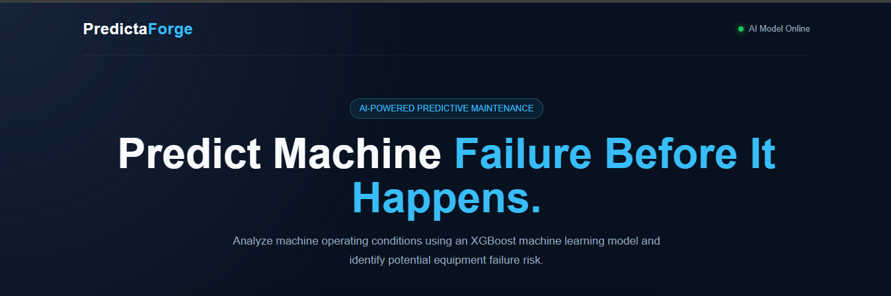
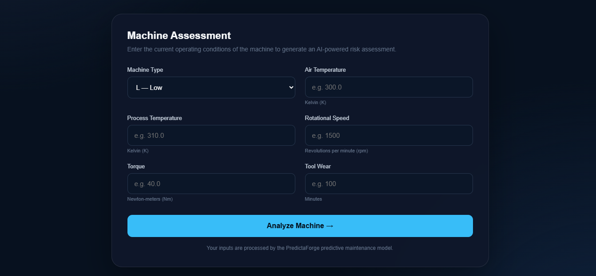
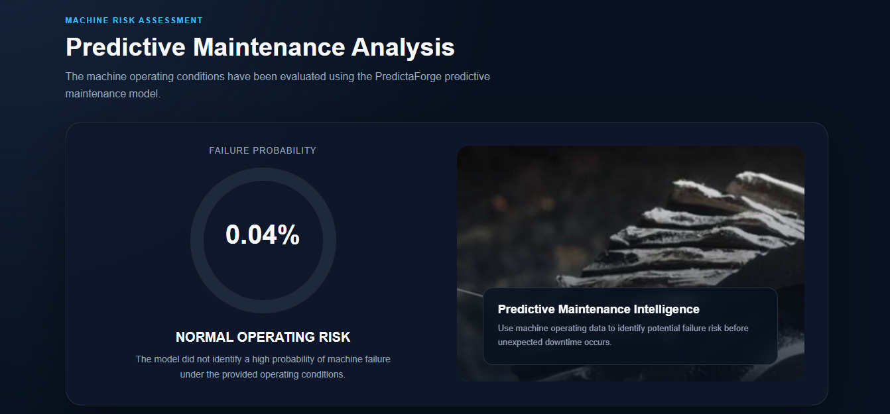
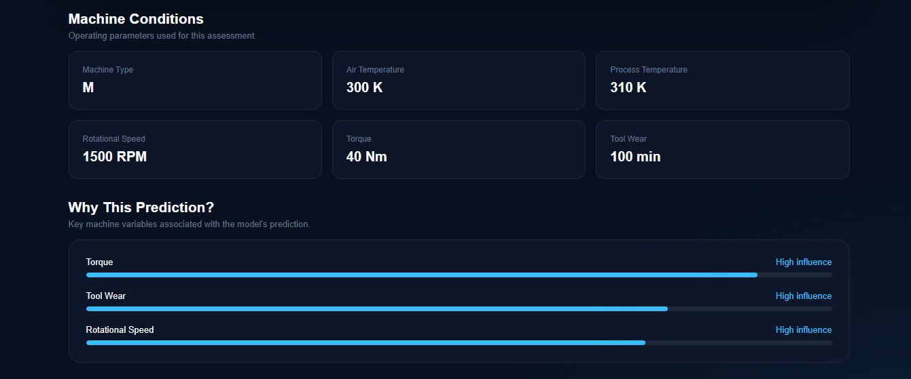

# PredictaForge — AI Predictive Maintenance

PredictaForge is an end-to-end machine learning application that predicts the probability of industrial machine failure using operating-condition data.

The project combines exploratory data analysis, machine learning, model evaluation, explainable AI, and a Flask-based web application into a complete predictive maintenance workflow.

## Live Demo

https://predictaforge.onrender.com

## Project Overview

Unexpected equipment failure can result in production downtime, maintenance costs, and operational disruption.

This project uses machine operating conditions such as temperature, rotational speed, torque, and tool wear to estimate the probability of machine failure before it occurs.

The final solution uses **XGBoost** as the primary predictive model and provides an interactive web interface where users can enter machine conditions and receive a failure-risk assessment.

## Dataset

The project uses the **AI4I 2020 Predictive Maintenance Dataset**.

Dataset characteristics:

- 10,000+ machine records
- 14 original variables
- Binary machine failure target
- Failure rate: 3.39%
- Significant class imbalance

### Input Features

- Machine Type
- Air Temperature [K]
- Process Temperature [K]
- Rotational Speed [rpm]
- Torque [Nm]
- Tool Wear [min]

The failure-mode indicator columns were excluded from the predictive model because they can directly reveal information about the failure event and introduce target leakage.

## Machine Learning Workflow

The project follows an end-to-end machine learning workflow:

1. Data loading and inspection
2. Data quality checks
3. Exploratory data analysis
4. Target imbalance analysis
5. Feature selection
6. Train/validation/test split
7. Categorical feature encoding
8. Baseline Logistic Regression model
9. Random Forest model
10. XGBoost model
11. Threshold optimization using validation data
12. Final evaluation on an untouched test set
13. Feature importance analysis
14. SHAP explainability
15. Model packaging
16. Flask deployment
17. Interactive web application

## Model Evaluation

Three models were evaluated using metrics appropriate for an imbalanced classification problem.

| Model | ROC-AUC | PR-AUC | Precision | Recall | F1 |
|---|---:|---:|---:|---:|---:|
| Logistic Regression | 0.900 | 0.434 | 0.67 | 0.15 | 0.24 |
| Random Forest | 0.959 | 0.775 | 0.91 | 0.46 | 0.61 |
| XGBoost | 0.970 | 0.813 | 0.761 | 0.750 | 0.756 |

The final XGBoost model was evaluated on a completely untouched test set.

### Final Test Results

- Accuracy: **98.35%**
- Precision: **76.12%**
- Recall: **75.00%**
- F1 Score: **75.56%**
- ROC-AUC: **0.970**
- PR-AUC: **0.813**

The model detected **51 of 68 actual machine failures** in the final test set.

Because machine failure is relatively rare, recall, precision, F1, ROC-AUC, and PR-AUC were considered alongside accuracy rather than relying on accuracy alone.

## Explainable AI

SHAP was used to understand which operating conditions contributed most to the model's predictions.

The strongest model features included:

1. Torque
2. Rotational Speed
3. Tool Wear
4. Air Temperature
5. Process Temperature

SHAP analysis also provides prediction-level explanations, allowing individual machine predictions to be examined rather than treating the model as a black box.

## Key Findings

The analysis identified several important patterns:

- Higher torque was associated with increased failure risk.
- Tool wear showed a threshold-like relationship with failure probability.
- Rotational speed had a nonlinear relationship with failure risk.
- Air and process temperature were correlated with each other.
- Torque and rotational speed showed a strong inverse correlation.

These relationships represent patterns learned from the dataset and should not be interpreted as direct causal relationships.

## Application Architecture

```text 
                    Machine Operating Data
                              |
                              v
                     Flask Web Application
                              |
                              v
                       Data Preprocessing
                              |
                              v
                       XGBoost Model
                              |
                              v
                    Failure Probability
                              |
                    +---------+---------+
                    |                   |
                    v                   v
                 Normal              Failure
                    |                   |
                    +---------+---------+
                              |
                              v
                    Prediction Results
                    + Model Explanation
```
# Web Application

PredictaForge provides a two-page workflow:

## Application Screenshots

### Machine Assessment




### Prediction Analysis




## Page 1 — Machine Assessment

Users enter:

- Machine type
- Air temperature
- Process temperature
- Rotational speed
- Torque
- Tool wear

The application sends the data to the Flask prediction API.

## Page 2 — Prediction Analysis

The result page displays:

- Failure probability
- Risk classification
- Machine operating conditions
- Key model influences
- Model performance metrics
- Predictive maintenance information

Industrial machine images are rotated between prediction sessions to provide a more dynamic interface.

# Technology Stack

Programming & Data

- Python
- Pandas
- NumPy
- Scikit-learn

Machine Learning

- XGBoost
- Random Forest
- Logistic Regression
- SHAP

Deployment

- Flask
- Gunicorn
- Render

Frontend

- HTML
- CSS
- JavaScript

Development

- Jupyter Notebook
- Git
- GitHub

# Model Deployment

The trained model, preprocessing pipeline, selected prediction threshold, and required feature information are packaged into a single deployment artifact.

The Flask application:

1) Receives machine operating data.
2) Applies the saved preprocessing pipeline.
3) Generates a failure probability using XGBoost.
4) Applies the validation-selected classification threshold.
5) Returns the prediction and probability to the frontend.

# Why This Project Matters

This project demonstrates more than model training.

It covers the complete workflow required to take a machine learning model from raw data to a usable application:

Data → EDA → Modeling → Evaluation → Explainability → Packaging → API → Deployment

## Future Improvements

Potential next steps include:

- Real-time machine sensor integration
Potential next steps include:

- Real-time machine sensor integration
- Time-series predictive maintenance
- Remaining Useful Life (RUL) prediction
- NASA C-MAPSS dataset integration
- Prediction logging and analytics
- Cloud database integration
- Maintenance recommendation engine
- Cost-based maintenance decision support

# Author

Soham Dewoolkar
https://www.linkedin.com/in/soham-dewoolkar-5428a0231/
